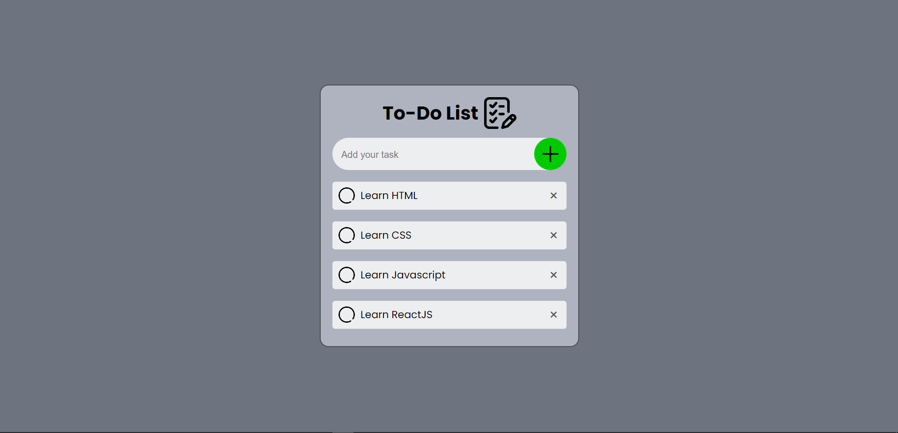
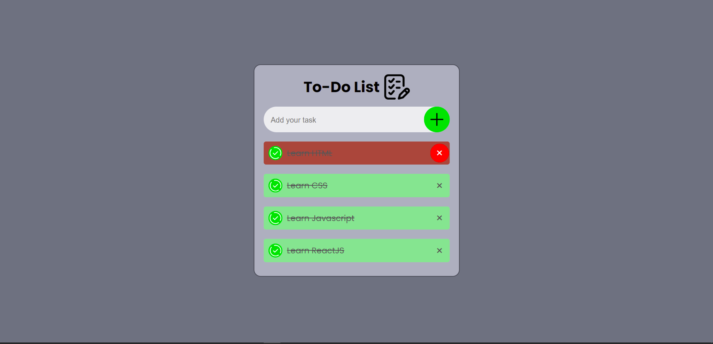

# To-Do List Application

This is a simple and interactive To-Do List application that helps you manage your daily tasks. You can add new tasks, mark them as completed, and delete them when they are no longer needed. The tasks are saved in your browser's local storage, so you won't lose them even if you refresh the page.

## Features

- Add new tasks to the list.
- Mark tasks as completed.
- Delete tasks from the list.
- Tasks are saved in local storage.

## Getting Started

### Prerequisites

You need a web browser to run this application.

### Usage

1. Enter your task in the input box that says "Add your task".
2. Click on the plus icon to add the task to the list.
3. Click on a task to mark it as completed.
4. Click on the cross icon next to a task to delete it.

### Project Structure

- `index.html`: The main HTML file that contains the structure of the application.
- `style.css`: The CSS file that contains the styles for the application.
- `app.js`: The JavaScript file that contains the logic for the application.
- `Resources/`: A directory that contains images and icons used in the application.

### Local Storage

The application uses the browser's local storage to save your tasks. This means that even if you close the browser or refresh the page, your tasks will remain.

### Customization

You can customize the appearance and functionality of the application by modifying the `style.css` and `app.js` files.

### Screenshot

## Acknowledgements

- Font Awesome for the icons.
- Google Fonts for the fonts used in the application.

